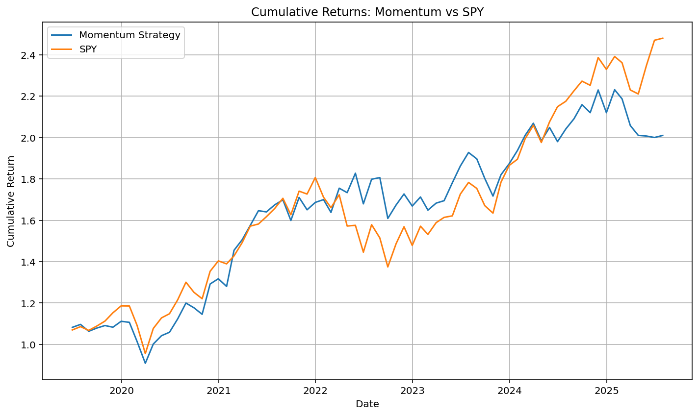
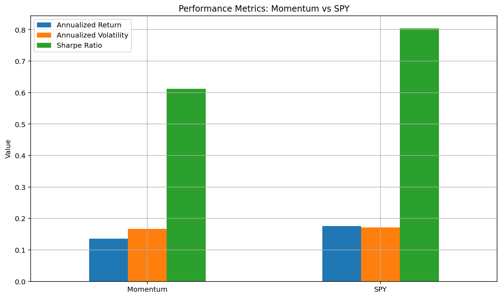

Performance Summary

| Metric                 | Momentum Strategy | SPY (Benchmark) |
|------------------------|-------------------|------------------|
| Annual Return          | 13.5%              | 17.5%            |
| Annual Volatility      | 16.7%              | 17.1%            |
| Sharpe Ratio(3M T-Bill)| 0.61               | 0.80             |   
| Max Drawdown           | -18.3%             | -23.9%           |
| Alpha                  | -0.0003            | –                |
| Beta                   | 0.81               | 1.00             |

---

- While SPY had a higher annual return, the momentum strategy demonstrated lower volatility and a smaller max drawdown, suggesting better downside protection.
- The Sharpe ratio was lower, indicating slightly worse risk-adjusted return in this time period.
- A Beta of 0.81 means the strategy is less sensitive to market swings, which may be desirable in high-volatility environments.

